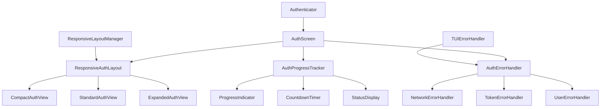

# Design Document

## Overview

This design addresses the critical usability issues in the GitHub CLI's authentication system by implementing a responsive, adaptive authentication interface with comprehensive error handling and recovery mechanisms. The solution builds upon the existing responsive layout system and error handling framework to create a seamless authentication experience across different terminal environments.

The design focuses on three core areas:
1. **Responsive Authentication UI** - Dynamic layout adaptation based on terminal size
2. **Enhanced Error Handling** - Comprehensive error recovery with user-friendly feedback
3. **Improved User Experience** - Better visual feedback, progress indicators, and accessibility

## Architecture

### Component Overview



### Integration Points

The design integrates with existing components:
- **ResponsiveLayoutManager**: Provides breakpoint detection and layout configuration
- **TUIErrorHandler**: Base error handling framework extended for authentication
- **Authenticator**: Core authentication logic remains unchanged
- **AuthScreen**: Enhanced with responsive layout and error handling

## Components and Interfaces

### 1. ResponsiveAuthLayout

A new component that manages the authentication screen layout based on terminal size.

```python
class ResponsiveAuthLayout:
    """Manages responsive layout for authentication screens."""
    
    def __init__(self, layout_manager: ResponsiveLayoutManager):
        self.layout_manager = layout_manager
        self.current_view: AuthView | None = None
    
    def get_optimal_layout(self) -> AuthLayoutConfig:
        """Determine optimal layout based on terminal size."""
        
    def create_auth_view(self, config: AuthLayoutConfig) -> AuthView:
        """Create appropriate auth view for current layout."""
        
    def handle_resize(self, new_size: Size) -> None:
        """Handle terminal resize during authentication."""
```

**Layout Configurations:**

- **Compact Layout** (< 60 cols, < 15 rows):
  - Vertical stacking of elements
  - Minimal text, essential information only
  - Single-line status indicators
  - Abbreviated instructions

- **Standard Layout** (60-100 cols, 15-25 rows):
  - Balanced horizontal/vertical layout
  - Full instructions with formatting
  - Progress indicators with details
  - Action buttons with labels

- **Expanded Layout** (> 100 cols, > 25 rows):
  - Rich visual elements
  - Detailed progress information
  - Multiple action options
  - Enhanced visual feedback

### 2. AuthErrorHandler

Specialized error handler for authentication-specific scenarios.

```python
class AuthErrorHandler(TUIErrorHandler):
    """Enhanced error handling for authentication flows."""
    
    def __init__(self, app: App, auth_screen: AuthScreen):
        super().__init__(app)
        self.auth_screen = auth_screen
        self.retry_strategies = self._init_retry_strategies()
    
    async def handle_auth_error(self, error: AuthenticationError) -> AuthRecoveryAction:
        """Handle authentication-specific errors with recovery options."""
        
    async def handle_network_error(self, error: NetworkError) -> bool:
        """Handle network errors with automatic retry logic."""
        
    async def handle_token_error(self, error: TokenError) -> bool:
        """Handle token-related errors with user guidance."""
```

**Error Recovery Strategies:**

- **Network Errors**: Automatic retry with exponential backoff, network diagnostics
- **Token Expiration**: Automatic restart of auth flow with context preservation
- **User Denial**: Clear explanation and retry options
- **Rate Limiting**: Wait time display with progress indicator
- **Browser Issues**: Alternative access methods (manual URL, QR codes)

### 3. AuthProgressTracker

Manages progress indication and user feedback during authentication.

```python
class AuthProgressTracker:
    """Tracks and displays authentication progress."""
    
    def __init__(self, layout: ResponsiveAuthLayout):
        self.layout = layout
        self.current_step: AuthStep = AuthStep.INITIALIZING
        self.progress_widgets: dict[str, Widget] = {}
    
    def update_step(self, step: AuthStep, details: dict[str, Any] = None):
        """Update current authentication step with details."""
        
    def show_waiting_indicator(self, message: str, timeout: int = None):
        """Show waiting indicator with optional timeout."""
        
    def show_countdown(self, duration: int, message: str):
        """Show countdown timer for delays."""
```

**Progress Steps:**
1. **Initializing** - Setting up authentication flow
2. **Requesting Code** - Contacting GitHub for device code
3. **Waiting for User** - User needs to authorize in browser
4. **Polling Token** - Checking for authorization completion
5. **Validating** - Verifying token and fetching user info
6. **Complete** - Authentication successful

### 4. Enhanced AuthScreen

The main authentication screen with responsive design and error handling.

```python
class EnhancedAuthScreen(Screen[AuthResult]):
    """Enhanced authentication screen with responsive design."""
    
    def __init__(self, authenticator: Authenticator, layout_manager: ResponsiveLayoutManager):
        super().__init__()
        self.authenticator = authenticator
        self.layout = ResponsiveAuthLayout(layout_manager)
        self.error_handler = AuthErrorHandler(self.app, self)
        self.progress_tracker = AuthProgressTracker(self.layout)
        self.preferences = AuthPreferences.load()
    
    def compose(self) -> ComposeResult:
        """Compose responsive authentication interface."""
        
    async def start_auth_flow(self) -> AuthResult:
        """Start authentication with comprehensive error handling."""
        
    async def handle_auth_failure(self, error: Exception) -> AuthRecoveryAction:
        """Handle authentication failures with recovery options."""
```

## Data Models

### AuthLayoutConfig

```python
@dataclass
class AuthLayoutConfig:
    """Configuration for authentication screen layout."""
    layout_type: Literal["compact", "standard", "expanded"]
    container_width: int
    container_height: int
    show_detailed_instructions: bool
    show_progress_details: bool
    enable_animations: bool
    button_layout: Literal["horizontal", "vertical", "grid"]
    text_truncation: bool
```

### AuthResult

```python
@dataclass
class AuthResult:
    """Result of authentication attempt."""
    success: bool
    user_info: UserInfo | None = None
    error: Exception | None = None
    retry_suggested: bool = False
    preferences_updated: bool = False
```

### AuthPreferences

```python
@dataclass
class AuthPreferences:
    """User preferences for authentication interface."""
    preferred_layout: str | None = None
    auto_open_browser: bool = True
    show_technical_details: bool = False
    remember_terminal_size: bool = True
    accessibility_mode: bool = False
    
    @classmethod
    def load(cls) -> AuthPreferences:
        """Load preferences from config."""
        
    def save(self) -> None:
        """Save preferences to config."""
```

## Error Handling

### Error Classification

**Network Errors:**
- Connection timeout
- DNS resolution failure
- Proxy/firewall blocking
- GitHub service unavailable

**Authentication Errors:**
- Invalid client ID
- Device code expired
- User denied authorization
- Token validation failure

**Environment Errors:**
- No browser available
- Clipboard access denied
- Terminal capabilities limited
- Display server unavailable

### Recovery Mechanisms

**Automatic Recovery:**
- Network retry with exponential backoff
- Token refresh on expiration
- Layout adaptation on resize
- Fallback to manual instructions

**User-Guided Recovery:**
- Clear error explanations
- Step-by-step troubleshooting
- Alternative authentication methods
- Preference adjustment options

## Testing Strategy

### Unit Tests

**ResponsiveAuthLayout Tests:**
- Layout selection based on terminal size
- Dynamic layout switching
- Widget positioning and sizing
- Responsive behavior validation

**AuthErrorHandler Tests:**
- Error classification accuracy
- Recovery strategy selection
- Retry logic with backoff
- User feedback generation

**AuthProgressTracker Tests:**
- Step progression tracking
- Progress indicator updates
- Timeout handling
- User interaction feedback

### Integration Tests

**Authentication Flow Tests:**
- Complete auth flow with different layouts
- Error injection and recovery
- Terminal resize during auth
- Network interruption handling

**Responsive Behavior Tests:**
- Layout adaptation across breakpoints
- Content visibility in compact mode
- User interaction in different layouts
- Accessibility compliance

### User Experience Tests

**Usability Testing:**
- Authentication success rates
- Error recovery effectiveness
- User satisfaction with feedback
- Accessibility compliance

**Performance Testing:**
- Layout switching performance
- Memory usage during auth
- Network retry efficiency
- Error handling overhead

## Implementation Phases

### Phase 1: Responsive Layout Foundation
- Implement ResponsiveAuthLayout component
- Create layout configurations for different breakpoints
- Add dynamic layout switching capability
- Update AuthScreen to use responsive layout

### Phase 2: Enhanced Error Handling
- Implement AuthErrorHandler with specialized strategies
- Add comprehensive error classification
- Implement retry mechanisms with user feedback
- Add error recovery workflows

### Phase 3: Progress and Feedback
- Implement AuthProgressTracker
- Add visual progress indicators
- Implement countdown timers and status displays
- Add user preference management

### Phase 4: Advanced Features
- Add accessibility enhancements
- Implement QR code fallbacks
- Add network diagnostics
- Implement authentication preferences

### Phase 5: Polish and Optimization
- Performance optimization
- Visual polish and animations
- Comprehensive testing
- Documentation and examples

## Accessibility Considerations

**Screen Reader Support:**
- Proper ARIA labels for all interactive elements
- Descriptive text for progress indicators
- Clear navigation instructions
- Status announcements for state changes

**High Contrast Mode:**
- Automatic detection of accessibility needs
- High contrast color schemes
- Enhanced focus indicators
- Reduced visual complexity

**Keyboard Navigation:**
- Full keyboard accessibility
- Clear focus indicators
- Logical tab order
- Keyboard shortcuts for common actions

## Security Considerations

**Token Handling:**
- Secure token storage during auth flow
- Automatic cleanup on failure
- No token logging or display
- Secure communication channels

**Error Information:**
- Sanitized error messages
- No sensitive data in logs
- User-friendly error descriptions
- Technical details only when requested

**Network Security:**
- HTTPS enforcement
- Certificate validation
- Proxy support
- Network timeout handling