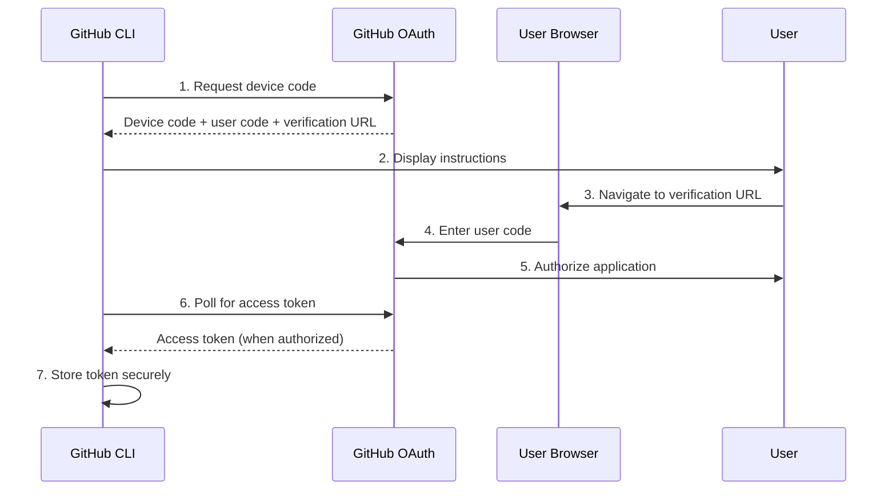

# OAuth Device Flow

GitHub CLI uses OAuth 2.0 Device Authorization Grant (RFC 8628) for secure, user-friendly authentication. This flow is specifically designed for devices with limited input capabilities or no web browser.

## 🔄 Flow Overview

The OAuth device flow consists of several steps that provide a secure authentication experience:



## 🚀 Implementation Details

### Step 1: Device Code Request

The CLI requests a device code from GitHub's OAuth endpoint:

```python
async def _request_device_code(self, scopes: str) -> Dict[str, Any]:
    """Request a device code from GitHub"""
    
    async with self._create_http_session() as session:
        async with session.post(
            self._auth_config.device_code_url,
            headers={
                "Accept": "application/json",
                "Content-Type": "application/json"
            },
            json={
                "client_id": self._auth_config.client_id,
                "scope": scopes
            }
        ) as response:
            return await response.json()
```

**Request Parameters:**
- `client_id`: GitHub CLI application ID
- `scope`: Requested permissions (e.g., "repo,user,gist")

**Response:**
```json
{
    "device_code": "3584d83530557fdd1f46af8289938c8ef79f9dc5",
    "user_code": "WDJB-MJHT",
    "verification_uri": "https://github.com/login/device",
    "verification_uri_complete": "https://github.com/login/device?user_code=WDJB-MJHT",
    "expires_in": 900,
    "interval": 5
}
```

### Step 2: User Instructions

The CLI displays authentication instructions adapted to the user's environment:

```python
async def _display_auth_instructions(self, device_code_data: Dict[str, Any]) -> None:
    """Display authentication instructions to the user"""
    
    # Detect environment capabilities
    detector = EnvironmentDetector()
    capabilities = detector.detect()
    
    # Select appropriate strategy
    adapter = EnvironmentAdapter()
    instructions = adapter.create_instructions(device_code_data, capabilities)
    
    # Display instructions
    await self._show_instructions(instructions)
```

#### Browser Auto-Open Strategy
```python
if capabilities.has_browser and preferences.auto_open_browser:
    print("🌐 Opening GitHub in your browser...")
    webbrowser.open(verification_uri_complete)
    print(f"👆 If the browser didn't open, visit: {verification_uri}")
    print(f"🔑 Enter code: {user_code}")
```

#### Manual Browser Strategy
```python
print("🌐 Please open your browser and visit:")
print(f"   {verification_uri}")
print(f"🔑 Enter this code: {user_code}")

if capabilities.has_clipboard:
    pyperclip.copy(user_code)
    print("📋 Code copied to clipboard!")
```

#### QR Code Strategy
```python
if capabilities.has_qr_support:
    qr = qrcode.QRCode(version=1, box_size=1, border=1)
    qr.add_data(verification_uri_complete)
    qr.make(fit=True)
    
    print("📱 Scan this QR code with your mobile device:")
    qr.print_ascii(invert=True)
```

#### Text-Only Strategy
```python
print("🔐 GitHub Authentication Required")
print("=" * 40)
print(f"1. Open a web browser")
print(f"2. Navigate to: {verification_uri}")
print(f"3. Enter the code: {user_code}")
print(f"4. Authorize GitHub CLI")
print("=" * 40)
```

### Step 3: Token Polling

The CLI polls GitHub's token endpoint until the user completes authorization:

```python
async def _poll_for_token(self, device_code: str, interval: int) -> Dict[str, Any]:
    """Poll for access token until user completes authorization"""
    
    start_time = time.time()
    timeout = self._auth_config.poll_timeout
    
    while time.time() - start_time < timeout:
        try:
            token_data = await self._request_access_token(device_code)
            
            if "access_token" in token_data:
                return token_data
            
            error = token_data.get("error")
            if error == "authorization_pending":
                # User hasn't completed authorization yet
                await asyncio.sleep(interval)
                continue
            elif error == "slow_down":
                # Increase polling interval
                interval += 5
                await asyncio.sleep(interval)
                continue
            elif error == "expired_token":
                raise AuthenticationError("Device code expired. Please try again.")
            elif error == "access_denied":
                raise AuthenticationError("Authorization denied by user.")
            else:
                raise AuthenticationError(f"OAuth error: {error}")
                
        except aiohttp.ClientError as e:
            logger.warning(f"Network error during token polling: {e}")
            await asyncio.sleep(interval)
    
    raise AuthenticationError("Authentication timed out.")
```

**Polling Behavior:**
- **authorization_pending**: Continue polling (user hasn't authorized yet)
- **slow_down**: Increase polling interval by 5 seconds
- **expired_token**: Device code expired (15 minutes)
- **access_denied**: User denied authorization
- **success**: Access token received

### Step 4: Token Storage

Once the access token is received, it's stored securely:

```python
def save_token(self, token_data: Dict[str, Any], host: str = "github.com") -> str:
    """Save token securely with metadata"""
    
    token = token_data.get("access_token")
    if not token:
        raise AuthenticationError("No access token in response")
    
    # Add metadata
    token_data["created_at"] = time.time()
    token_data["host"] = host
    
    # Generate secure filename
    token_prefix = token[:4]
    token_file = self.tokens_dir / f"{host}-{token_prefix}.json"
    
    # Save encrypted token data
    encrypted_data = self._encrypt_token_data(token_data)
    with open(token_file, 'wb') as f:
        f.write(encrypted_data)
    
    # Set as active token
    self._set_active_token(token_file)
    
    return token
```

## 🔧 Configuration

### OAuth Configuration

```python
@dataclass
class AuthenticationConfig:
    # GitHub OAuth endpoints
    client_id: str = "Iv1.b507a08c87ecfe98"
    device_code_url: str = "https://github.com/login/device/code"
    token_url: str = "https://github.com/login/oauth/access_token"
    
    # Default permissions
    default_scopes: str = "repo,user,gist"
    
    # Polling configuration
    poll_interval: int = 5      # Seconds between polls
    poll_timeout: int = 900     # 15 minutes timeout
    
    # Rate limiting
    max_retries: int = 3
    retry_delay: float = 1.0
```

### Scope Configuration

GitHub CLI requests specific scopes based on functionality:

```python
SCOPE_DESCRIPTIONS = {
    "repo": "Full access to repositories",
    "repo:status": "Access to commit status",
    "repo_deployment": "Access to deployment statuses",
    "public_repo": "Access to public repositories only",
    "repo:invite": "Access to repository invitations",
    "security_events": "Read and write security events",
    "user": "Access to user profile information",
    "user:email": "Access to user email addresses",
    "user:follow": "Access to follow/unfollow users",
    "gist": "Create and access gists",
    "workflow": "Access to GitHub Actions workflows",
    "write:packages": "Upload packages to GitHub Package Registry",
    "read:packages": "Download packages from GitHub Package Registry",
    "delete:packages": "Delete packages from GitHub Package Registry",
    "admin:org": "Full control of organizations",
    "write:org": "Read and write access to organization membership",
    "read:org": "Read-only access to organization membership",
    "admin:public_key": "Full control of user public keys",
    "write:public_key": "Write access to user public keys",
    "read:public_key": "Read access to user public keys",
    "admin:repo_hook": "Full control of repository hooks",
    "write:repo_hook": "Write access to repository hooks",
    "read:repo_hook": "Read access to repository hooks",
    "admin:org_hook": "Full control of organization hooks",
    "notifications": "Access to notifications",
    "delete_repo": "Delete repositories"
}
```

## 🎯 Adaptive Strategies

The OAuth flow adapts to different environments and user preferences:

### Environment Detection

```python
@dataclass
class EnvironmentCapabilities:
    has_display: bool           # GUI display available
    has_browser: bool          # Web browser available
    has_clipboard: bool        # Clipboard access
    has_qr_support: bool       # QR code display support
    terminal_width: int        # Terminal dimensions
    terminal_height: int
    is_ssh: bool              # SSH session
    is_ci: bool               # CI/CD environment
    is_container: bool        # Container environment
    screen_reader: bool       # Screen reader detected
```

### Strategy Selection

```python
def select_strategy(self, capabilities: EnvironmentCapabilities) -> AuthStrategy:
    """Select optimal authentication strategy"""
    
    # CI/CD environments
    if capabilities.is_ci:
        return AuthStrategy.TEXT_ONLY
    
    # SSH sessions
    if capabilities.is_ssh:
        if capabilities.has_qr_support:
            return AuthStrategy.QR_CODE
        return AuthStrategy.TEXT_ONLY
    
    # Desktop environments
    if capabilities.has_browser and capabilities.has_display:
        return AuthStrategy.BROWSER_AUTO
    
    # Terminal-only environments
    if capabilities.has_qr_support:
        return AuthStrategy.QR_CODE
    
    return AuthStrategy.TEXT_ONLY
```

## 🚨 Error Handling

### Common OAuth Errors

```python
class OAuthError(AuthenticationError):
    """OAuth-specific authentication error"""
    
    def __init__(self, error_code: str, description: str = None):
        self.error_code = error_code
        self.description = description
        super().__init__(f"OAuth error: {error_code}")

# Specific error types
class DeviceCodeExpiredError(OAuthError):
    """Device code has expired"""
    pass

class AuthorizationDeniedError(OAuthError):
    """User denied authorization"""
    pass

class SlowDownError(OAuthError):
    """Polling too frequently"""
    pass
```

### Error Recovery

```python
async def handle_oauth_error(self, error: OAuthError) -> bool:
    """Handle OAuth errors with recovery options"""
    
    if isinstance(error, DeviceCodeExpiredError):
        print("⏰ Device code expired. Starting new authentication...")
        return await self.login_interactive()
    
    elif isinstance(error, AuthorizationDeniedError):
        print("❌ Authorization denied.")
        print("💡 You can try again or contact your administrator.")
        return False
    
    elif isinstance(error, SlowDownError):
        print("⏳ Slowing down polling rate...")
        self._auth_config.poll_interval += 5
        return True
    
    else:
        print(f"❌ OAuth error: {error}")
        return await self._show_troubleshooting_guide(error)
```

## 📊 Security Considerations

### Token Security

1. **Secure Storage**: Tokens stored in OS keyring or encrypted files
2. **Limited Scope**: Request minimal required permissions
3. **Token Rotation**: Support for token refresh and rotation
4. **Expiration Handling**: Automatic token renewal

### Network Security

1. **HTTPS Only**: All communication over encrypted connections
2. **Certificate Validation**: Strict SSL certificate verification
3. **Request Signing**: OAuth request signing for integrity
4. **Rate Limiting**: Respect GitHub's rate limits

### User Privacy

1. **Minimal Data**: Only collect necessary information
2. **Local Storage**: Tokens stored locally, not transmitted
3. **User Control**: Users can revoke access anytime
4. **Audit Trail**: Authentication events logged

## 📝 Usage Examples

### Basic Authentication

```python
# Simple authentication
authenticator = Authenticator(config)
await authenticator.login_interactive()
```

### Custom Scopes

```python
# Authenticate with specific scopes
await authenticator.login_interactive(
    scopes="repo,user,workflow,admin:org"
)
```

### Environment-Specific Authentication

```python
# Force specific strategy
adapter = EnvironmentAdapter()
adapter.force_strategy(AuthStrategy.QR_CODE)

await authenticator.login_interactive()
```

### Programmatic Authentication

```python
# For automated environments
if os.getenv("GITHUB_TOKEN"):
    # Use provided token
    authenticator.set_token(os.getenv("GITHUB_TOKEN"))
else:
    # Fall back to interactive flow
    await authenticator.login_interactive()
```

## 🔗 Related Documentation

- [Authentication Overview](README.md)
- [Token Management](tokens.md)
- [SSO Support](sso.md)
- [GitHub OAuth Documentation](https://docs.github.com/en/developers/apps/building-oauth-apps/authorizing-oauth-apps#device-flow)
